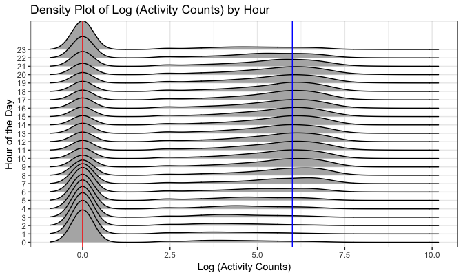
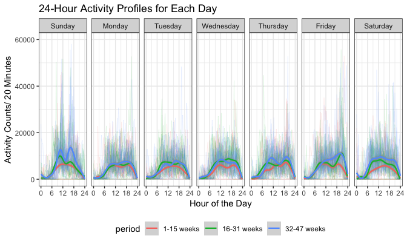

p8105\_mtp\_jl5297
================
Jun Lu
10/16/2018

Overview
--------

This document conducts analyses focused on understanding patterns of physical activity of a participant over 47 weeks. The data for this project was collected on a 63 year-old male with BMI 25, who was admitted to the Advanced Cardiac Care Center of Columbia University Medical Center and diagnosed with congestive heart failure. He wore an accelerometerdevice that continuously recorded physical activity for several months. Our data came from this accelerometerdevice.

All analyses in this document are based on data in “p8105\_mtp\_data.csv”.

Data cleaning
-------------

``` r
activity_df = read_csv("./data/p8105_mtp_data.csv") %>% 
    gather(key = minute, value = activity_counts, activity.1:activity.1440) %>%
    mutate(minute = str_replace(minute, "activity.", ""),
           day = fct_relevel(day, c("Sunday", "Monday", "Tuesday","Wednesday", "Thursday", "Friday", "Saturday")),
           minute = as.integer(minute)) %>% 
    arrange(week, day, minute)

str(activity_df)
```

    ## Classes 'tbl_df', 'tbl' and 'data.frame':    473760 obs. of  4 variables:
    ##  $ week           : int  1 1 1 1 1 1 1 1 1 1 ...
    ##  $ day            : Factor w/ 7 levels "Sunday","Monday",..: 1 1 1 1 1 1 1 1 1 1 ...
    ##  $ minute         : int  1 2 3 4 5 6 7 8 9 10 ...
    ##  $ activity_counts: num  1 1 1 1 1 1 1 1 1 1 ...

We load the data from “p8105\_mtp\_data.csv” and use `gather` to go from wide to long formats. Two variables(`minute` and `day`) are transformed into integer and factor as necessary. And we arrange it by week, day and minute. There are 473760 observations and 4 variables.

-   `week`: Week of observation
-   `day`: Day of the week
-   `minute`: Minute of observation
-   `activity_counts`: Voltage signals value in one minute epochs that are a proxy for acceleration

Exploratory analysis
--------------------

### Density plot of activity counts

``` r
activity_df %>% 
    ggplot(aes(x = activity_counts)) +
    geom_density() +
    labs(
        title = "Density Plot of Activity Counts",
        x = "Activity Counts/Minute",
        y = "Density"
    )
```


-   From the density plot, wen can see the distribution of `activity_counts` is extremely skewed where some points are much larger than the bulk of the data. The range of activity counts is (1, 10417) and the mean is 240.34. When this participant has no activity, activity counts equal to 1

### Find days with no activity

``` r
activity_df %>% 
    group_by(week, day) %>% 
    summarize(total_activity = sum(activity_counts)) %>%  
    filter(total_activity == 1440) 
```

    ## # A tibble: 18 x 3
    ## # Groups:   week [10]
    ##     week day       total_activity
    ##    <int> <fct>              <dbl>
    ##  1     1 Saturday            1440
    ##  2     2 Sunday              1440
    ##  3     3 Sunday              1440
    ##  4     3 Wednesday           1440
    ##  5     3 Thursday            1440
    ##  6     3 Friday              1440
    ##  7     4 Monday              1440
    ##  8     4 Wednesday           1440
    ##  9     4 Thursday            1440
    ## 10     4 Friday              1440
    ## 11     8 Friday              1440
    ## 12    12 Sunday              1440
    ## 13    12 Friday              1440
    ## 14    12 Saturday            1440
    ## 15    13 Monday              1440
    ## 16    19 Saturday            1440
    ## 17    20 Saturday            1440
    ## 18    32 Monday              1440

-   We find that there are 18 days that activity counts shows no activity. Those days are mainly in week 3, 4 and 12.

Total activity analysis
-----------------------

### 1. Total activity trend analysis

``` r
activity_df %>% 
    group_by(week) %>% 
    summarise(total_activity = sum(activity_counts)) %>% 
    ggplot(aes(x = week, y = total_activity)) +
    geom_point() +
    geom_line() +
    geom_smooth() +
    labs(
        title = "Week Total Activity Counts vs Week",
        x = "Week",
        y = "Week Total Activity Counts"
    )
```

 We aggregate accross minutes of each week to create a total activity variable and then make a scatterplot of total activity over weeks. While there has been large variability, the total activity has an upward trend over weeks. We can infer that this participant became more active over time.

### 2. The effect of day of the week on total activity

``` r
day_total_acitivity = 
    activity_df %>% 
    group_by(week, day) %>%
    summarize(day_total_activity = sum(activity_counts))

day_total_boxplot =
    day_total_acitivity %>% 
    ggplot(aes(x = day, y = day_total_activity, fill = day)) +
    geom_boxplot() +
    theme(legend.position = "right") +
    labs(
        title = "Day Total Activity for Different Days of the Week",
        x = "Day of the Week",
        y = "Day Total Activity Counts"
    )


day_total_difference =
    day_total_acitivity %>% 
    group_by(week) %>% 
    mutate(difference = day_total_activity - mean(day_total_activity)) %>%
    ggplot(aes(x = day, y = difference, fill = day)) + 
    geom_boxplot() + 
    theme(legend.position = "right") +
    labs(
        title = "Difference Values for Different Days of the Week",
        x = "Day of the Week",
        y = "Difference Values"
    )
    
day_total_boxplot + day_total_difference + plot_layout(ncol = 1)
```


-   We aggregate accross minutes of each day to create a day total activity variable.
-   In isolation: We make boxplots of total activity of different days of the week to examine the possibility that day of the week affects activity.
-   In addition to the effect of time: In order to remove the effect of the time, we calculate difference values between day total activity and the mean of day total activity of the week(day total activity - the mean of day total activity of the week). And then we make boxplots of these difference values of of different days of the week in another panel.

As ranges of boxplots overlap and their medians are only slightly different(both in isolation and in addition to the effect of time), there is no enough evidence that that day of the week affects total activity.

Distribution of activity counts by hour
---------------------------------------

``` r
activity_df %>% 
    mutate(hour = (minute - 1) %/% 60,
           activity_counts = log(activity_counts)) %>%
    ggplot(aes(x = activity_counts, y = factor(hour))) +
    geom_density_ridges(scale = 4) +
    geom_vline(xintercept = 0, color = "red") +
    geom_vline(xintercept = 6, color = "blue") +
    labs(
        title = "Density Plot of Log (Activity Counts) by Hour",
        x = "Log (activity counts)",
        y = "Hour of the day"
    ) 
```



Because the original distribution is quite skewed, we make a density plot of log(activity counts) in the full dataset by hour. From the plot we can see this participant tends to have activity from 7 a. m. to 10 p. m.

24-hour activity profiles analysis
----------------------------------

``` r
activity_df %>% 
    mutate(period = week %/% 16,
           period = factor(period, levels = c(0, 1, 2), labels = c("1-15 weeks", "16-31 weeks", "32-47 weeks")),
           time = minute %/% 20 * 20 / 60) %>% 
    group_by(period, week, day, time) %>% 
    summarize(activity_counts = sum(activity_counts)) %>% 
    ggplot(aes(x = time, y = activity_counts, color = week)) +
    viridis::scale_color_viridis() +
    geom_line(aes(group = week), size = 0.1) +
    facet_grid(period ~ day) +
    geom_smooth(size = 0.5, color = "red") +
    scale_x_continuous(breaks = seq(0, 24, by = 6)) +
    labs(
        title = "24-Hour Activity Profiles for Each Day",
        x = "Hour of the Day",
        y = "Activity Counts/ 20 Minutes"
    )
```

 We divide weeks into 3 periods(1-15, 16-31, 32-47 weeks) to show the effect of the time. And we aggregate data into 20-minute epochs to make plots more clear. Then we make a polt which shows 24-hour activity profiles for each day. In this plot, we use `facet_grid` to form a matrix of panels defined by period and day of the week. Smooth estimates of mean activity profiles of each panel are emphasized as red bold curves.

From this plot, we find that:

-   On Sunday, this participant tends to have high activity around 9 a. m. and 16 p. m.
-   On Friday, this participant tends to have high activity around 8 p. m.
